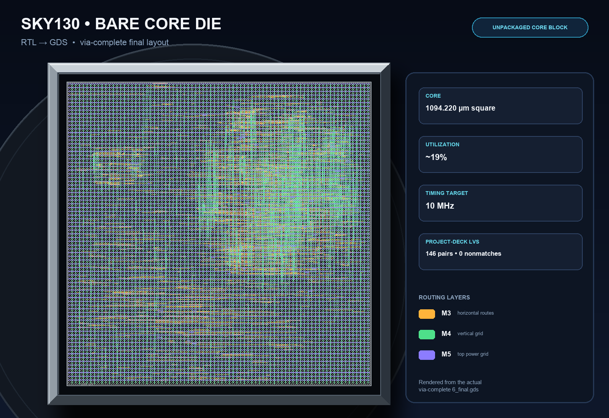
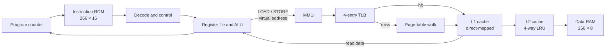
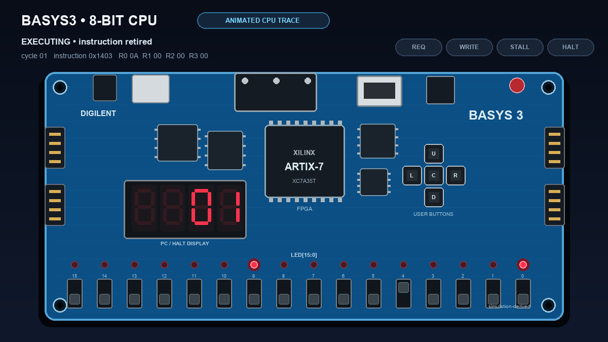
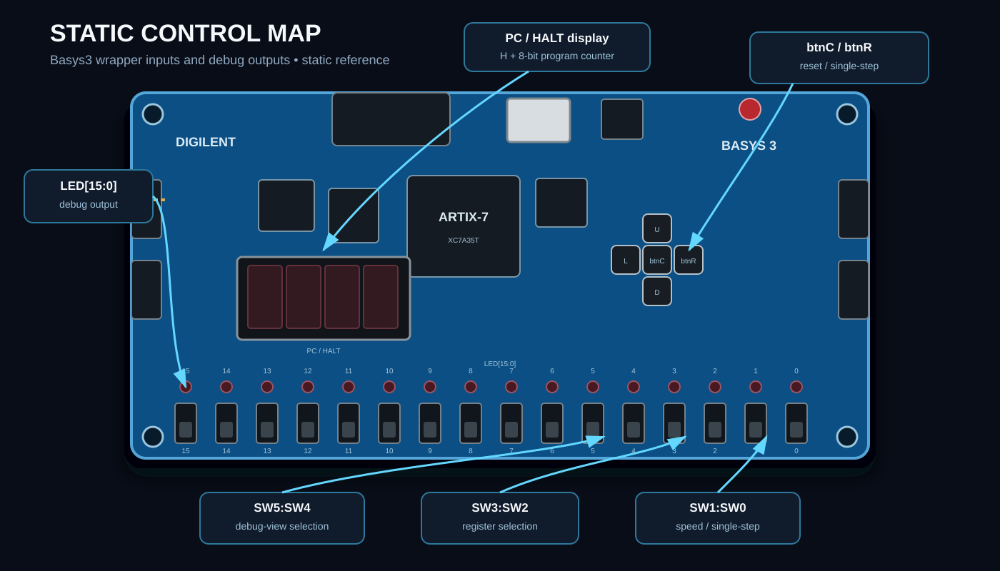

# 8-bit CPU: RTL to GDS

I designed an 8-bit CPU in Verilog, gave it a two-level write-back cache and
virtual memory, and carried the complete core from module simulation through a
verified Sky130 physical layout. The repository includes the RTL, assembler,
FPGA wrapper, end-to-end regressions, and reproducible ASIC flow configuration.



*The actual via-complete `6_final.gds`, shown front-facing as a bare silicon
die. The routing geometry is unchanged; the metallic edge, wafer background,
verified metrics, and layer legend are presentation elements. This is an
unpackaged core block, not a fabricated or packaged chip.*

## What I built

| Part | Result |
|---|---|
| CPU | 8-bit datapath, four registers, zero/carry flags, 8-bit PC, and a 12-instruction ISA |
| Memory | Harvard architecture with a 256 × 16 instruction ROM and 256 × 8 data RAM |
| Cache | Direct-mapped L1 plus four-way set-associative L2; both use 4-byte blocks and write-back |
| Virtual memory | 16-byte pages, four-entry fully associative TLB, hardware page-table walks, PTE-triggered TLB flush, and page faults |
| Tooling | Two-pass C++ assembler with labels, decimal/hex immediates, validation, and 256-word `.mem` output |
| FPGA | Basys3 wrapper with 1/2/4 Hz clocks, single-step mode, register/memory/fault LEDs, and hexadecimal PC display |
| ASIC | Sky130 HD standard-cell core hardened from RTL through routed GDS, timing, DRC, and project-deck LVS |

The ISA contains `MOV`, `ADD`, `SUB`, `AND`, `OR`, `NOT`, `LOAD`, `STORE`,
`JMP`, `JZ`, and `HALT` encodings. Instruction fetch is physical; every data
LOAD/STORE uses a virtual address.

## How it works



On a TLB miss, the MMU reads the page-table entry through the same L1 → L2 →
RAM path, fills the TLB, and replays the original access. A completed store to
the page-table area flushes the TLB so a remap is visible on the next access.
An invalid entry latches the faulting virtual address and freezes the CPU until
reset.

## How I built it

1. **Started with the datapath.** I implemented and tested the ALU, register
   file, decoder, instruction memory, data memory, and program counter as
   separate modules.
2. **Added the memory hierarchy.** I built L1 and L2 independently, then tested
   hits, cold misses, eviction, LRU selection, and dirty write-back through the
   complete hierarchy.
3. **Integrated the CPU.** The datapath, caches, and RAM were connected in
   `cpu_top.v`, then exercised with arithmetic, branch, store/load, and halt
   programs.
4. **Added address translation.** A TLB and MMU introduced page walks,
   software-writable PTEs, remapping, automatic TLB invalidation, and a stable
   page-fault state.
5. **Prepared hardware targets.** I added a debounced Basys3 interface for slow
   and single-step inspection, then hardened the core with the Sky130 HD flow
   from synthesis through final GDS.

## How I tested it

The standard regression runs 15 Verilog suites, a complete Basys3 wrapper
compile check, and assembler/LVS-deck checks with one command:

```bash
make test
```

| Verification level | What is checked | Status |
|---|---|---|
| Modules | ISA operations, flags, registers, PC control, ROM/RAM handshakes | Passing |
| Caches | L1/L2 hits and misses, byte fills, LRU eviction, dirty write-back | Passing |
| Full CPU | Three demo programs with final PC/register/cache assertions | Passing |
| Virtual memory | TLB hit/miss/flush, page walk, remap, invalid PTE, frozen fault state | Passing |
| Assembler | Encodings, labels, output padding, and error reporting | Passing |
| Physical core | 10 MHz timing, detailed-route DRC, antenna, standalone KLayout DRC, and project-deck electrical LVS | Clean |

The most important end-to-end VM test deliberately loads a stale TLB entry,
rewrites its PTE, proves the later store reaches the new physical page, then
accesses an invalid page and confirms that the PC and registers remain frozen
with the correct fault address.

See [testing and verification](docs/testing.md) for coverage and individual
commands.

## FPGA demonstration

### Animated simulation

Watch the hexadecimal PC, red LEDs, cycle count, and memory-status indicators
change as the verified program executes.



*A Basys3-style board generated from an asserted full-CPU trace. It shows the
real PC, register, request, stall, and halt state from simulation; it is not
physical-board footage.*

### Static control map

This diagram does not animate; it identifies the physical controls and debug
outputs used by the FPGA wrapper.



The wrapper supports a normal slow clock or manual single stepping, while the
switches select register, PC, memory/cache, and page-fault views. The complete
control map, demo programs, expected states, and Vivado bitstream steps are in
the [Basys3 FPGA guide](docs/fpga.md).

## ASIC result

| Metric | Final result |
|---|---|
| Technology | Sky130 HD standard cells |
| Core size | 1,094.220 µm × 1,094.220 µm |
| Standard cells | 12,778, including 3,824 sequential cells |
| Final utilization | About 19% |
| Timing target | 10 MHz; 90.29 ns worst setup slack |
| Estimated minimum period | 9.71 ns, or 102.96 MHz |
| Route checks | 0 detailed-route DRC violations; 0 antenna violations |
| Standalone layout DRC | 0 markers |
| Project-deck electrical LVS | 146 circuit pairs, 0 nonmatches |
| Final GDS | 34,672,628 bytes; SHA-256 `EB8056AF757277F4828EB0E29479399363749B9FE188F15C5EBE53F8C93879CD` |

The result is a verified core, not a fabrication-ready chip. It still needs a
shuttle wrapper and padframe, I/O/ESD cells, an ASIC-safe boot and memory
initialization plan, compatible memory macros or a standard-cell memory
decision, and qualified foundry DRC/LVS signoff. The full flow, stream-out fix,
metrics, verification scope, and limitations are in the
[OpenROAD hardening report](openroad/README.md).

## Reproduce the main results

```bash
# Build and run the complete regression
make test

# Regenerate the trace-driven FPGA visuals
python3 -m pip install -r requirements-visuals.txt
make fpga-readme-assets

# Build the assembler
mkdir -p build
g++ -std=c++17 -O2 assembler.cpp -o build/assembler
```

FPGA bitstream instructions are in [docs/fpga.md](docs/fpga.md); the Sky130
hardening command is in [openroad/README.md](openroad/README.md).

## Repository map

| Path | Contents |
|---|---|
| `design/` | Synthesizable CPU, cache, MMU/TLB, memory, and Basys3 RTL |
| `sim/` | Module, integration, program, VM, and trace testbenches |
| `programs/` | Ready-to-run cache, ALU, and branch memory images |
| `tests/` | Assembler, physical-deck, trace, and visual-asset checks |
| `tools/` | Reproducible FPGA and GDS visual renderers |
| `requirements-visuals.txt` | Pillow dependency for the trace-driven GIF and image checks |
| `openroad/` | Sky130 HD configuration, timing constraints, LVS deck, and hardening report |
| `docs/` | FPGA/testing guides, design specifications, plans, and README images |

## Where the project is now

The complete CPU, cache hierarchy, and virtual-memory design pass simulation,
and the full core has a project-verified Sky130 GDS. The Basys3 wrapper and
constraints are ready for a Vivado/board run, but this repository does not
contain evidence of a completed physical-board test, and no chip has been
fabricated yet.

The next cost-focused direction is a **fixed-ROM CPU Lite for Tiny Tapeout**.
That smaller edition has been selected as the likely first fabrication target,
but it has not been implemented yet.
